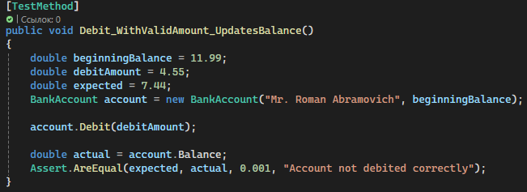
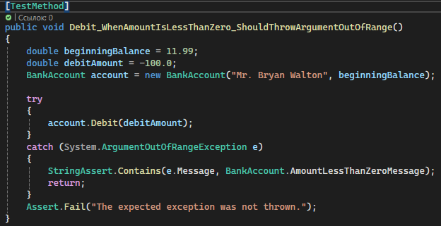
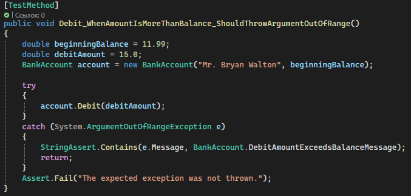
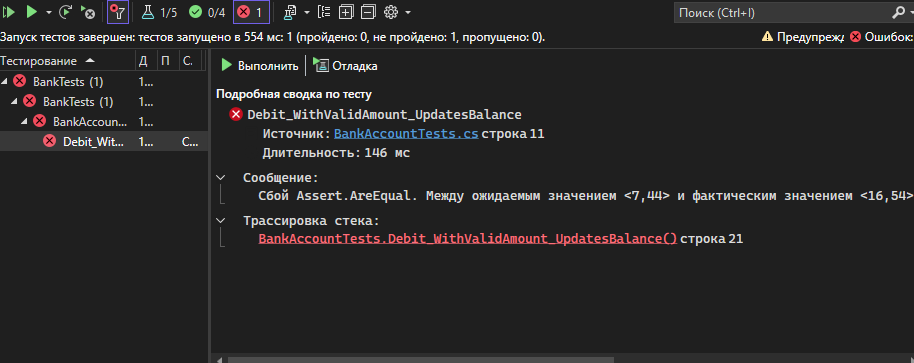
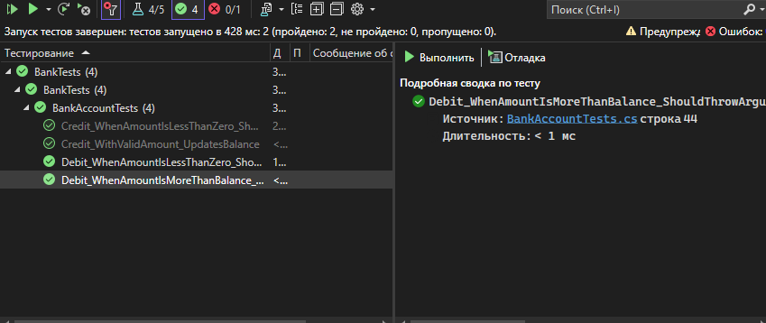
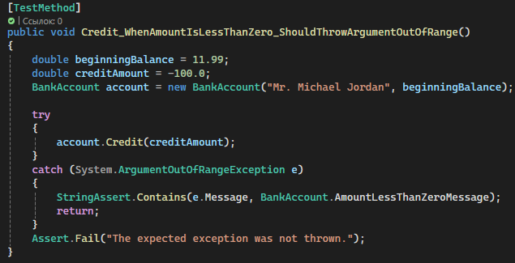
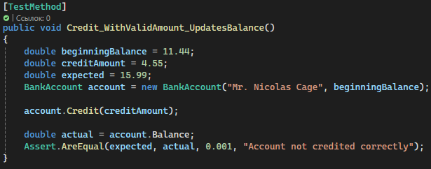
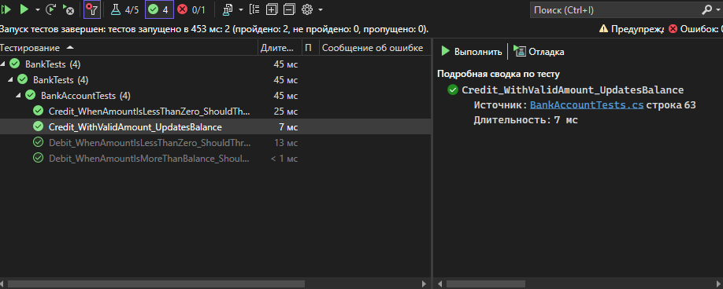

# Практическая работа 6

# СОЗДАНИЕ АВТОМАТИЗИРОВАННЫХ UNIT-ТЕСТОВ

## Создание проета банка и создание проекта модульного тестирования


#### Создание методов для тестирования метода debit




После создания запускаем тест


Тест не был проеден - требуется рефакторинг метода debit 

После рефакторинга:
Определили две константы 
```C#
public const string DebitAmountExceedsBalanceMessage = "Debit amount exceeds balance";
public const string DebitAmountLessThanZeroMessage = "Debit amount is less than zero";
```
Изменили два условных оператора в методе Debit

```C#
if (amount > m_balance)
{
    throw new System.ArgumentOutOfRangeException("amount", amount, DebitAmountExceedsBalanceMessage);
}

if (amount < 0)
{
    throw new System.ArgumentOutOfRangeException("amount", amount, DebitAmountLessThanZeroMessage);
}
```

Добавили также блок try/catch

Запускаем тест


Тесты показывают положительный результат

#### Создание методов для тестирования метода Credit





Запускаем тестирование 


Тесты показали положительный результат, следовательно рефакторинг не потребуется.